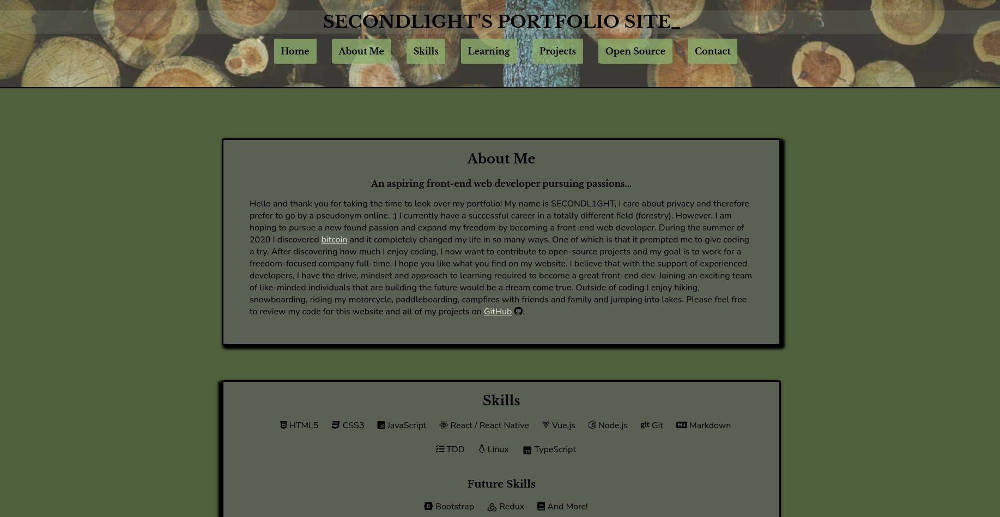

# SECONDL1GHT'S PORTFOLIO SITE

This is my working project for my personal portfolio, I am an aspiring front-end developer interested in contributing to bitcoin.

Link to site: https://secondl1ght.site

## Table of Contents

-   [General Info](#general-information)
-   [Technologies Used](#technologies-used)
-   [Features](#features)
-   [Screenshots](#screenshots)
-   [Project Status](#project-status)
-   [Room for Improvement](#room-for-improvement)
-   [Acknowledgements](#acknowledgements)
-   [Contact](#contact)

## General Information

-   I hope to display some of my skills and knowledge with HTML, CSS and JS to potential employers through this website as well as give a bit of insight into my personality and interests.

## Technologies Used

-   HTML5
-   CSS3
-   JavaScript

## Features

-   Responsive to different screen sizes
-   Interactive with JS and CSS transitions
-   CSS animations to improve UX/UI
-   Dynamic pages with JS without loading new HTML
-   CSS flexbox utilized
-   Mostly semantic HTML
-   Organized code with notes and proper descriptors
-   Monochromatic color theme
-   Accessible

## Screenshots

## Project Status

Project is: _in progress_

I will continue to update this site with new information as I create more projects and progress in my career.

## Room for Improvement

-   The design is not the most complicated or cutting edge but I do like the simplicity and ease of viewing the website has.

## Acknowledgements

-   Header background (<https://unsplash.com/photos/jKd68S1rWes>)
-   Fonts by Google Fonts
-   Icons by (<https://www.fontawesome.com>), (<https://www.icons8.com>) and <a href="https://www.flaticon.com/authors/pixel-perfect" title="Pixel perfect">Pixel perfect</a> from <a href="https://www.flaticon.com/" title="Flaticon">www.flaticon.com</a>

## Contact

If you would like to contact me please send me a message on Discord @secondl1ght#9164 or by e-mail at secondl1ght@protonmail.com, I would love to hear from you!
